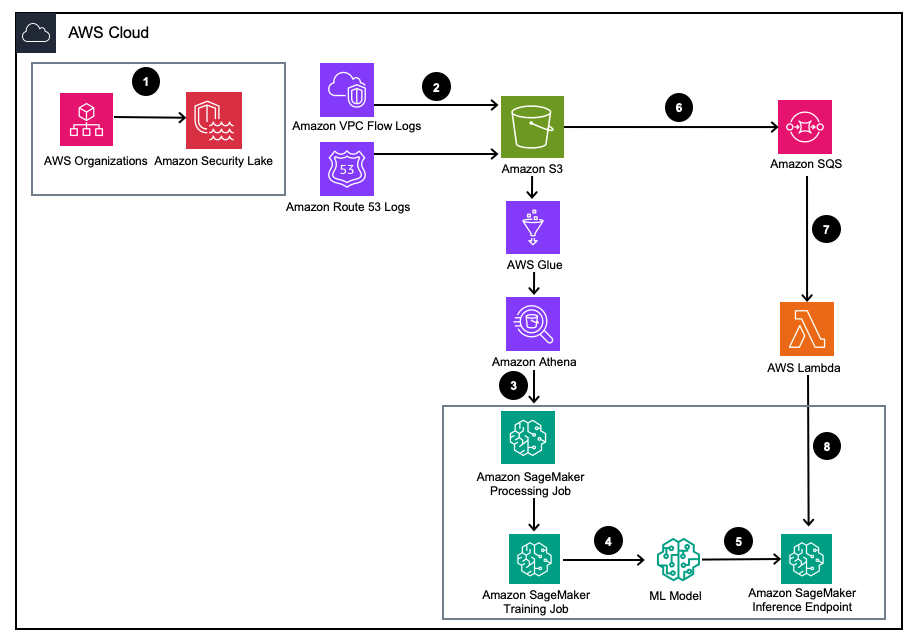

## **Amazon Security Lake SageMaker Workshop**

[Amazon Security Lake](https://aws.amazon.com/security-lake/) automatically centralizes security data from AWS environments, SaaS providers, on premises, and cloud sources into a purpose-built data lake stored in your account. With Security Lake, you can get a more complete understanding of your security data across your entire organization. You can also improve the protection of your workloads, applications, and data. Security Lake has adopted the Open Cybersecurity Schema Framework (OCSF), an open standard. With OCSF support, the service normalizes and combines security data from AWS and a broad range of enterprise security data sources.

[Amazon SageMaker](https://aws.amazon.com/sagemaker) SageMaker is a fully managed service to prepare data and build, train, and deploy machine learning (ML) models for any use case with fully managed infrastructure, tools, and workflows.

This AWS workshop consists of several modules that integrate Amazon Security Lake and Amazon SageMaker, and it demonstrates how to analyze security log data at scale using machine learning on AWS.

## **Pre-Requisites** ##

To deploy the solution, you must first complete the following prerequisites:

1.  Enable Amazon Security Lake within your organization or a single account with both VPC Flow Logs and Route 53 resolver logs enabled.
2.  Ensure that the AWS Identity and Access Management (IAM) role used by SageMaker processing jobs and notebooks has been granted an IAM policy including the Amazon Security Lake subscriber query access permission for the managed Amazon Security lake database and tables managed by AWS Lake Formation. This processing job should be run from within an analytics or security tooling account to remain compliant with AWS Security Reference Architecture (AWS SRA).

## **Clone Git repo**
```
git clone https://github.com/aws-samples/amazon-securitylake-sagemaker-workshop
cd amazon-securitylake-sagemaker-workshop
```
## **Module 1**

Demonstrates how to analyze network security log data stored in Amazon Security Lake using the IP Insights algorithm available in Amazon SageMaker.



### Build Module
```
cd 01_ipinsights
sam build --region us-east-1 --template 01.02-ipcheck.yaml --profile myprofile

....

Build Succeeded
```

### Validate and test Git repo locally 

Uses default AWS credentials located at ~/.aws/credentials
```
sam validate --template 01.02-ipcheck.yaml --profile myprofile

```

### Deploy SAM app to AWS

Use deployment parameter values for the `ENDPOINT_NAME` and `SQSQueueARN` that are appropriate for your environment and use case. 

It is likely that this solution will reside where you already setup Security Lake for your AWS Organization in the delegated security administrator account and designated rollup region.  

Also, note that the SageMaker endpoint was generated during the earlier Jupyter Notebook steps and that the SQS endpoint was created by Security Lake during setup.

```
sam deploy --guided capabilities CAPABILITY_NAMED_IAM --debug --region us-east-1 --profile myprofile

Stack Name [sam-app]: sam-securitylake-sagemaker-ipinsights-app
AWS Region [us-east-1]: 
Parameter SQSQueueARN []: arn:aws:sqs:us-east-1:028667762794:SecurityLake_us-east-1_MAIN_QUEUE_1_0
Parameter SageMakerEndpoint []: ipinsights-2023-09-21-16-40-26-825

....

Confirm changes before deploy [y/N]: y
Allow SAM CLI IAM role creation [Y/n]: Y
Disable rollback [y/N]: y

... 
        Deploying with following values
        ===============================
        Stack name                   : sam-securitylake-sagemaker-ipinsights-app
        Region                       : us-east-1
        Confirm changeset            : True
        Disable rollback             : True
        Deployment s3 bucket         : aws-sam-cli-managed-default-samclisourcebucket-dni4abqt2gfi
        Capabilities                 : ["CAPABILITY_IAM"]
        Parameter overrides          : {"SQSQueueARN": "arn:aws:sqs:us-east-1:028667762794:SecurityLake_us-east-1_MAIN_QUEUE_1_0", "SageMakerEndpoint": "ipinsights-2023-09-21-16-40-26-825"}
        Signing Profiles             : {}

Initiating deployment
=====================

2023-09-21 11:48:25,880 | Collected default values for parameters: {}                                                                                                                                            
2023-09-21 11:48:25,921 | Sam customer defined id is more priority than other IDs.         
2023-09-21 11:48:25,924 | 0 stacks found in the template                                                                                                                                                         
2023-09-21 11:48:25,926 | Collected default values for parameters: {}           
2023-09-21 11:48:25,959 | 1 resources found in the stack                                                                                                                                                         
2023-09-21 11:48:26,296 | Stack with id sam-securitylake-sagemaker-ipinsights-app does not exist                                                                                                                 
        Uploading to sam-securitylake-sagemaker-ipinsights-app/d47781a1b3df0dade31015aac10457d7.template  2431 / 2431  (100.00%)

Waiting for changeset to be created..

CloudFormation stack changeset
------------------------------------------------------------------------------------------------------
Operation          LogicalResourceId                                   ResourceType                  
------------------------------------------------------------------------------------------------------
+ Add              SecurityLakeSageMakerIpInsightsFunctionEventInvok   AWS::Lambda::EventInvokeConfig
+ Add              SecurityLakeSageMakerIpInsightsFunctionRole         AWS::IAM::Role                 
+ Add              SecurityLakeSageMakerIpInsightsFunctionSQS1         AWS::Lambda::EventSourceMapping
+ Add              SecurityLakeSageMakerIpInsightsFunction             AWS::Lambda::Function          
------------------------------------------------------------------------------------------------------

Changeset created successfully. arn:aws:cloudformation:us-east-1:028667762794:changeSet/samcli-deploy1695314906/2e6454f8-8aa1-40ed-b23c-49eee3fc4a48

Previewing CloudFormation changeset before deployment
======================================================

```

## **Future Work**

* Demonstrate integration with additional data sets from on-premise, partners, and cloud providers.
* Demonstrate integration with additional algorithms that analyze  network, host, and other security log data.
* Demonstrate integration with other security monitoring solutions from AWS and partners.

## **Security**

See [CONTRIBUTING](CONTRIBUTING.md#security-issue-notifications) for more information.

## **License**

This library is licensed under the MIT-0 License. See the LICENSE file.